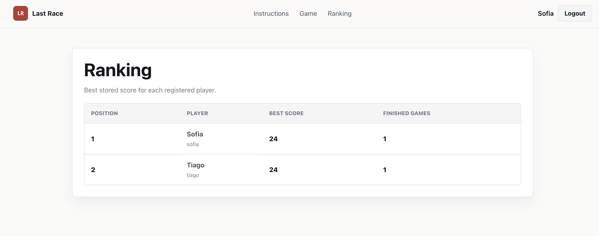
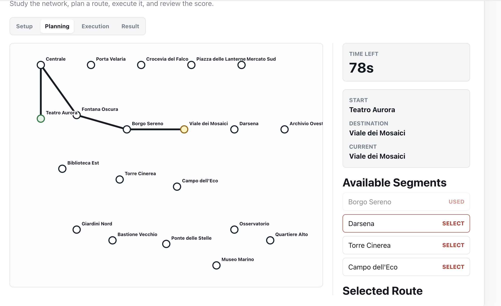

# Exam 1 — Last Race

**Student:** Tiago Felice
**Stack:** React 19, React Router, Express, Passport.js, sessions, and SQLite.

Last Race is a single-player metro route-planning game. The server assigns a
start and destination, validates the route and deadline, applies random events,
stores the result, and exposes a best-score ranking.

## Run the project

Start the API server:

```bash
cd server
npm install
npm run seed
node index.js
```

Start the React client in a second terminal:

```bash
cd client
npm install
npm run dev
```

`npm run seed` recreates the local SQLite database and removes previously
played games. The client is normally available at `http://localhost:5173`.

## Server-side

### HTTP APIs

| Method and endpoint | Parameters and exchanged objects |
| --- | --- |
| `GET /api/instructions` | Public. Returns the game goal, the four phase descriptions, and anonymous-access rules. |
| `GET /api/sessions/current` | Public. Returns `{ user: null }` or the authenticated user's `id`, `username`, and `displayName`. |
| `POST /api/sessions` | Public. Accepts `{ username, password }`; creates a session cookie and returns the authenticated user. |
| `DELETE /api/sessions/current` | Public. Destroys the current session and returns `204 No Content`. |
| `GET /api/game/setup` | Authenticated. Returns the complete network: stations, lines, segments, and interchange stations. |
| `POST /api/games` | Authenticated. Creates a planning game and returns its assignment, server deadline, station-only map, and selectable segments. |
| `POST /api/games/:id/submit-route` | Authenticated. Accepts `{ route: [{ fromStationId, toStationId }] }`; returns validation, execution steps, and final score. |
| `GET /api/games/:id/steps` | Authenticated. Returns a submitted game's assignment and its stored execution steps. |
| `GET /api/ranking` | Authenticated. Returns one row per player with a stored score, ordered by best score. |

### Database tables

| Table | Purpose |
| --- | --- |
| `users` | Registered accounts, including the username, display name, password salt, and password hash. |
| `stations` | Metro station names and coordinates used to draw the network. |
| `lines` | Metro line names and display colours. |
| `line_stops` | Ordered stations for each line; consecutive stops define playable segments. |
| `events` | Random event descriptions and coin deltas from `-4` to `+4`. |
| `games` | Game ownership, assignment, planning deadline, submitted route, status, and final score. |
| `game_steps` | One stored event and running coin total for each segment of a completed game. |

## Client-side

### React routes

| Route | Purpose |
| --- | --- |
| `/` | Public instructions page with the current login status. |
| `/login` | Controlled username/password form that creates a session. |
| `/game` | Protected game flow: setup, planning, execution, and result. |
| `/ranking` | Protected table of the best stored score for each player. |

### Main React components

| Component | Purpose |
| --- | --- |
| `App` | Defines the React Router routes, navigation header, and protected-page wrapper. |
| `SessionProvider` | Keeps the authenticated user and session actions in shared React context. |
| `GameView` and `useGameFlow` | Coordinate the setup, planning, execution, and result phases. |
| `NetworkMap` | Renders the metro network and the route selected by the player as SVG. |
| `PlanningPhase` | Displays the server deadline, assignment, selectable segments, and route controls. |
| `ExecutionPhase` and `ResultPhase` | Display event-by-event scoring and the final result. |
| `RankingView` | Loads and renders the authenticated users' best-score ranking. |

## Screenshots

> **Still required:** save the two images below at these exact paths and commit
> them to the repository. The links will render as embedded screenshots once the files exist.





## Registered users

| Username | Password |
| --- | --- |
| `tiago` | `tiagopass` |
| `sofia` | `sofiapass` |
| `marco` | `marcopass` |

## AI usage

ChatGPT/Codex was used as a learning assistant to explain concepts, organize
implementation steps, generate starting code, and debug issues. Generated output
was read and adapted, then verified through code review, database seeding, linting,
production builds, and local API checks.
